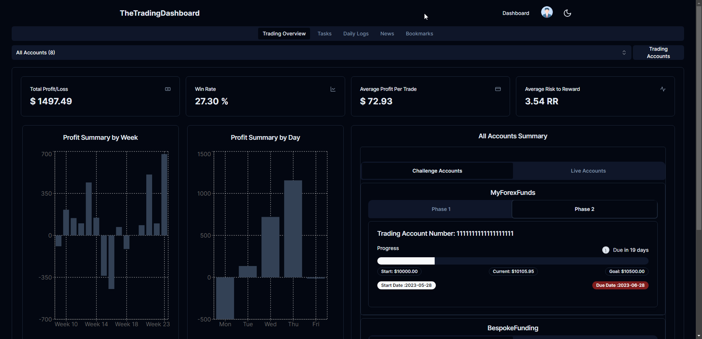
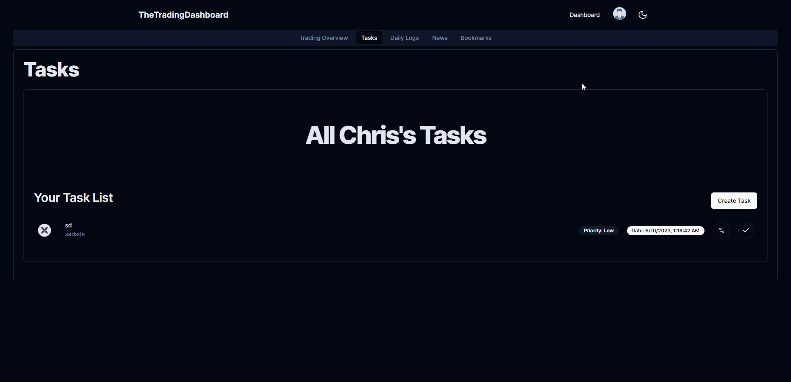
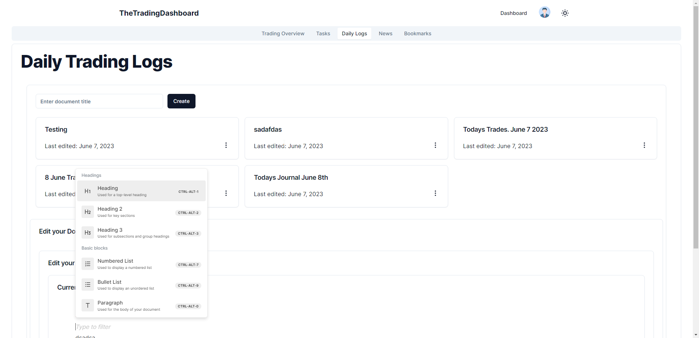
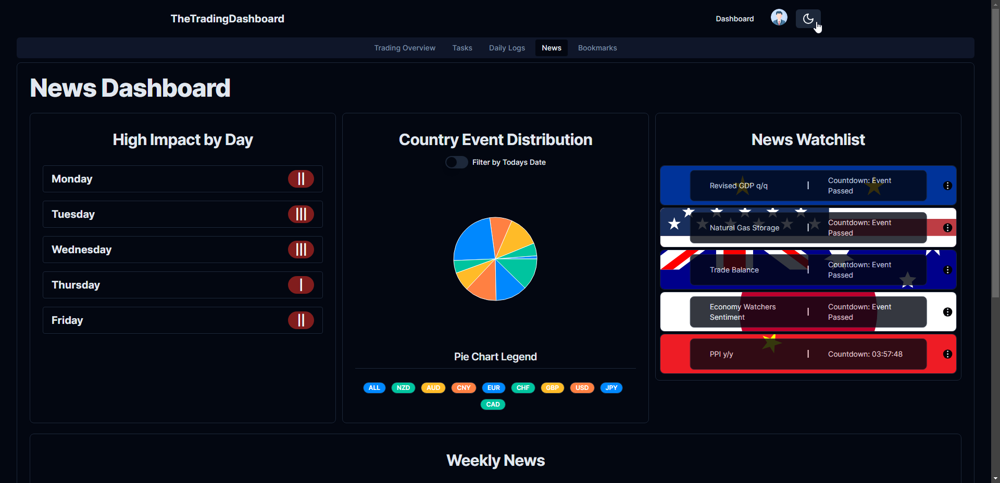
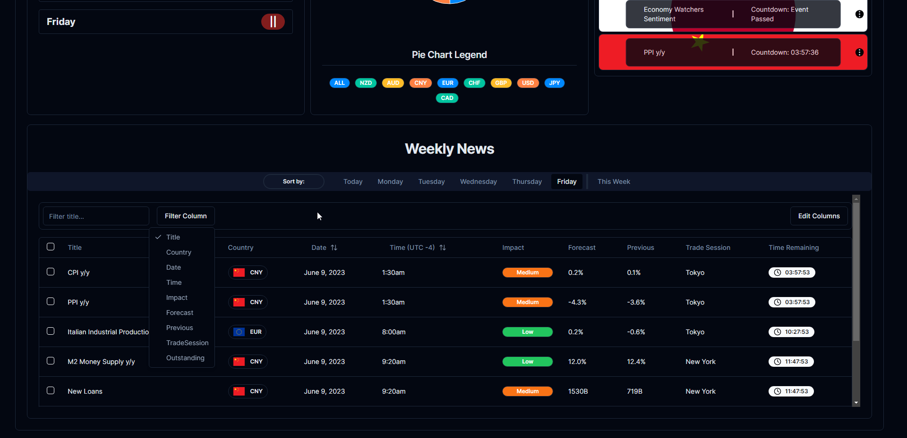
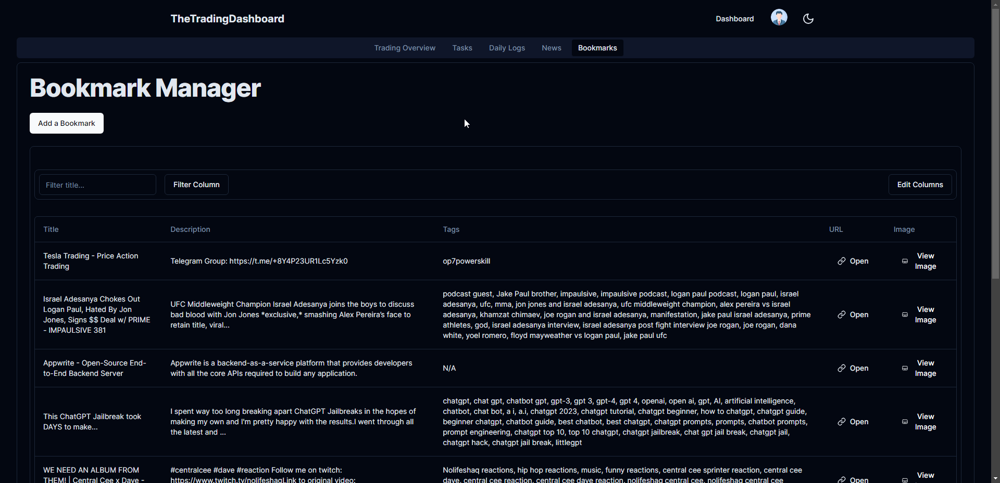

# TheTradingDashboard

This is a [Next.js](https://nextjs.org/) project with the new Nextjs 13 App Directory. Auth, and Database managed with [`appwrite`](https://appwrite.io/).

You will find a Getting Started below to guide you on how to setup this project for yourself.

This is my entry to the 2023 [Appwrite Hackathon](https://hashnode.com/hackathons/appwrite).
Be sure to check out my [HashNode](https://hashnode.com/hackathons/appwrite) article for more details.
You can find a video demo below of the application.

### Desktop View

Link

### Mobile View

Link

### Recommended Mentions

For the best UI Library check out [shadcn/ui](https://ui.shadcn.com/)

## Features

The images below give you a small glimpse at what TheTradingDashboard offers:

### Trading Statistics (Select through all or specific accounts to summarise data)



### Task Manager



### Daily Trade Journal



### Beautiful News Dashboard




### Bookmark Manager to help you manage your learning materials(Search and filter functionality for ease of use).



## Getting Started

Before you are able to run the development server, you will need to update the .env.local
If you do not have a .env.local file in the main app directory then go ahead and create one.
Populate it with the following informaiton

```bash
NEXT_PUBLIC_APPWRITE_PROJECT_ID=
NEXT_PUBLIC_APPWRITE_DATABASE_ID=
NEXT_PUBLIC_APPWRITE_USER_COLLECTION_ID=
NEXT_PUBLIC_APPWRITE_USER_MDXDOCS_COLLECTION_ID=
NEXT_PUBLIC_APPWRITE_USER_PROPFIRMGROUPS_COLLECTION_ID=
NEXT_PUBLIC_APPWRITE_USER_TRADING_ACCOUNT_DATA_COLLECTION_ID=
NEXT_PUBLIC_APPWRITE_USER_NEWS_COLLECTION_ID=
NEXT_PUBLIC_APPWRITE_USER_BOOKMARKS_COLLECTION_ID=
NEXT_PUBLIC_APPWRITE_NEWS_COLLECTION_ID=
NEXT_PUBLIC_APPWRITE_PUBLIC_NEWS_DOCUMENT_ID=
```

You will also need to create a Web App in Appwrite aswell as a database, and the correct collections.
Follow the steps below to setup your Appwrite Cloud Database correctly.

1. Navigate to your [Appwrite Console](https://cloud.appwrite.io/console) and create a Project.
2. Copy your Project ID into you .env.local as NEXT_PUBLIC_APPWRITE_PROJECT_ID
3. In your project create a Database. Copy your Database ID into you .env.local as NEXT_PUBLIC_APPWRITE_DATABASE_ID
4. In your Database create a new collection calles 'Users'. Copy your Collection ID into you .env.local as NEXT_PUBLIC_APPWRITE_USER_COLLECTION_ID
5. Within this Collection create the following attributes;
   1. KEY:'email' TYPE:'string' SIZE:'256'
   2. KEY:'username' TYPE:'string' SIZE:'256'
   3. KEY:'userId' TYPE:'string' SIZE:'256'
   4. KEY:'tasks' TYPE:'string_ARRAY' SIZE:'256'
   5. KEY:'firstName' TYPE:'string' SIZE:'256'
   6. KEY:'latName' TYPE:'string' SIZE:'256'
   7. KEY:'avatarUrl' TYPE:'string' SIZE:'256'
   8. KEY:'phoneNumber' TYPE:'string' SIZE:'256'
   9. KEY:'bio' TYPE:'string' SIZE:'256'
   10. KEY:'country' TYPE:'string' SIZE:'256'
   11. KEY:'cityState' TYPE:'string' SIZE:'256'
   12. KEY:'postalCode' TYPE:'string' SIZE:'256'
6. Within the settings of this collection, Update Permissions to All Users with Create, Read, Update, Delete.
7. In your Database create a new collection calles 'Markdown Documents'. Copy your Collection ID into you .env.local as NEXT_PUBLIC_APPWRITE_USER_MDXDOCS_COLLECTION_ID.
8. Within this Collection create the following attributes;
   1. KEY:'userId' TYPE:'string' SIZE:'256'
   2. KEY:'documentId' TYPE:'string' SIZE:'256'
   3. KEY:'title' TYPE:'string' SIZE:'256'
   4. KEY:'content' TYPE:'string' SIZE:'1073741824'
   5. KEY:'createdAt' TYPE:'string' SIZE:'256'
   6. KEY:'updatedAt' TYPE:'string' SIZE:'256'
9. Within the settings of this collection, Update Permissions to All Users with Create, Read, Update, Delete.
10. In your Database create a new collection calles 'Prop Firm Groups'. Copy your Collection ID into you .env.local as NEXT_PUBLIC_APPWRITE_USER_PROPFIRMGROUPS_COLLECTION_ID.
11. Within this Collection create the following attributes;
    1. KEY:'personal-accounts' TYPE:'string_ARRAY' SIZE:'1000000'
    2. KEY:'FTMO' TYPE:'string_ARRAY' SIZE:'1000000'
    3. KEY:'MyForexFunds' TYPE:'string_ARRAY' SIZE:'1000000'
    4. KEY:'MyFundedFx' TYPE:'string_ARRAY' SIZE:'1000000'
    5. KEY:'BespokeFunding' TYPE:'string_ARRAY' SIZE:'1000000'
    6. KEY:'TrueForexFunds' TYPE:'string_ARRAY' SIZE:'1000000'
    7. KEY:'UserId' TYPE:'string' SIZE:'256'
12. Within the settings of this collection, Update Permissions to All Users with Create, Read, Update, Delete.
13. In your Database create a new collection calles 'Trading Account Data'. Copy your Collection ID into you .env.local as NEXT_PUBLIC_APPWRITE_USER_TRADING_ACCOUNT_DATA_COLLECTION_ID.
14. Within this Collection create the following attributes;
    1. KEY:'AccountKey' TYPE:'string' SIZE:'1000'
    2. KEY:'TradingHistory' TYPE:'string' SIZE:'1073741824'
15. Within the settings of this collection, Update Permissions to All Users with Create, Read, Update, Delete.
16. In your Database create a new collection calles 'News'. Copy your Collection ID into you .env.local as NEXT_PUBLIC_APPWRITE_NEWS_COLLECTION_ID.
17. Within this Collection create the following attributes;
    1. KEY:'lastUpdated' TYPE:'datetime'
    2. KEY:'news' TYPE:'string' SIZE:'1073741824'
18. Within the settings of this collection, Update Permissions to All Users with Create, Read, Update, Delete.
19. In your Database create a new collection calles 'User News'. Copy your Collection ID into you .env.local as NEXT_PUBLIC_APPWRITE_USER_NEWS_COLLECTION_ID.
20. Within this Collection create the following attributes;
    1. KEY:'userId' TYPE:'string' SIZE:'256'
    2. KEY:'userNews' TYPE:'string' SIZE:'1073741824'
21. Within the settings of this collection, Update Permissions to All Users with Create, Read, Update, Delete.
22. In your Database create a new collection calles 'User Bookmarks'. Copy your Collection ID into you .env.local as NEXT_PUBLIC_APPWRITE_USER_BOOKMARKS_COLLECTION_ID.
23. Within this Collection create the following attributes;
    1. KEY:'bookmarks' TYPE:'string' SIZE:'1073741824'
24. Within the settings of this collection, Update Permissions to All Users with Create, Read, Update, Delete.

This should complete your Appwrite Cloud setup.

Navigate into the main app directory. Then run the install dependencies and run the development server:

```bash
npm i

npm run dev

```

Open [http://localhost:3000](http://localhost:3000) with your browser to see the result.

If you plan to publish to vercel you need to upload your environmental variables ontop vercel.
You will also need to get your base url from vercel and update it in your appwrite project.

1. Navigate to your project in the appwrite console and scroll down to integrations where you will see your web app.
2. Click it and update your hostname to the base url of your vercel app.

For example if your url is 'http://localhost:3000' only use 'localhost:3000' as your hostname.
